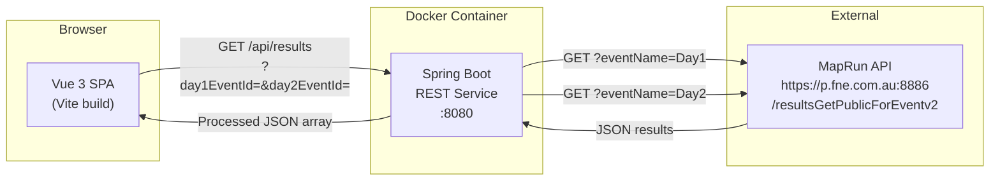

# Design Document: MapRun Results Processor

## Overview

The MapRun Results Processor is a two-component web application for aggregating and displaying orienteering results from the MapRun platform across a two-day event.

**Backend** — A Spring Boot REST service running inside Docker that:
1. Fetches raw JSON results from the MapRun public API for each event day on every request (no caching).
2. Applies deduplication scoring: any control visited on Day 2 that was already scored on Day 1 for the same participant is excluded from the Day 2 net score.
3. Calculates per-day net scores and combined total scores, sorts results, and returns a single JSON payload via `GET /api/results`.

**Frontend** — A Vue 3 single-page application (SPA) built with Vite that:
1. Reads event IDs and the backend base URL from a runtime-injected configuration object (no rebuild needed for reconfiguration).
2. Fetches processed results from the backend on load and on user-triggered refresh.
3. Renders a mobile-friendly results table with deduplication highlights.

### Key Design Decisions

| Decision | Choice | Rationale |
|---|---|---|
| Java framework | Spring Boot 3 | Production-grade, minimal boilerplate, strong ecosystem for REST + HTTP clients |
| Build tool | Maven | Wider adoption in Java orienteering/sports tooling; mature Docker multi-stage build patterns |
| HTTP client | Spring's `RestClient` (sync) | Simpler than WebClient for sequential two-call fetch; timeout config via `RestClientBuilder` |
| Vue setup | Vite + Vue 3 Composition API + TypeScript | Modern fast build, idiomatic for small SPAs |
| UI runtime config | Injected `window.__APP_CONFIG__` object in `index.html` | Allows reconfiguration by replacing a single `<script>` block at deploy time without rebuilding the SPA |
| CORS | Spring `@CrossOrigin` / `WebMvcConfigurer` | Allows fine-grained per-origin control via environment variable |
| Docker | Multi-stage build (Maven build → slim JRE runtime) | Small final image; no Maven installation needed on the host |

---

## Architecture



The backend makes two sequential HTTP GET requests to the MapRun API (one per day), processes the responses, and returns a single aggregated response. There is no persistence layer — all data flows through on each request.

---

## Components and Interfaces

### Backend Components

#### `ResultsController`
- Handles `GET /api/results?day1EventId={id}&day2EventId={id}`.
- Validates that both parameters are present and non-empty, returning `400` if not.
- Delegates to `ResultsService` and maps service exceptions to appropriate HTTP status codes (`400`, `502`).

#### `ResultsService`
- Orchestrates the two MapRun API fetches via `MapRunApiClient`.
- Passes raw per-day data to `ScoringEngine`.
- Returns a sorted list of `ParticipantResult` objects.

#### `MapRunApiClient`
- Wraps Spring `RestClient` for calling `https://p.fne.com.au:8886/resultsGetPublicForEventv2?eventName={eventName}`.
- Configured with a 30-second connect + read timeout.
- Throws typed exceptions for: HTTP error status, connection timeout, empty body, JSON parse failure, missing required fields.

#### `ScoringEngine`
- Pure stateless logic — no I/O.
- Accepts two lists of `MapRunParticipantRaw` (one per day).
- Performs deduplication: builds a per-participant set of Day 1 control IDs, then calculates Day 2 deductions.
- Computes `net1`, `net2`, and `total` scores.
- Sorts results: descending `totalScore`, then ascending last name on tie.

#### `AppStartupValidator`
- `ApplicationListener<ApplicationReadyEvent>` that checks `DAY1_EVENT_ID` and `DAY2_EVENT_ID` environment variables on startup.
- Logs an error and calls `System.exit(1)` if either is absent or blank.

#### `CorsConfig`
- `WebMvcConfigurer` that reads an `ALLOWED_ORIGIN` environment variable (defaults to `*` for development) and registers it for `GET /api/**`.

### Frontend Components

#### `App.vue`
- Root component. Reads `window.__APP_CONFIG__` to obtain `apiBaseUrl`, `day1EventId`, and `day2EventId`.
- Manages fetch state (`idle | loading | success | error`) and exposes results data to child components.
- Renders `LoadingSpinner`, `ErrorMessage`, `EmptyState`, or `ResultsTable` conditionally.

#### `ResultsTable.vue`
- Receives the sorted `ParticipantResult[]` array as a prop.
- Renders the table with all required columns.
- Applies a CSS highlight class to deduction cells where `day2Deduction > 0`.
- Uses `overflow-x: auto` on the table wrapper to allow horizontal scrolling on narrow viewports without disrupting the page layout.

#### `useResults` composable (`useResults.ts`)
- Encapsulates all fetch logic using Vue 3 `ref` and `computed`.
- Exposes: `results`, `loading`, `error`, `refresh()`.
- Uses `fetch()` with the configured base URL and event ID query params.
- Disables the refresh button (`isRefreshing` ref) while a request is in progress.

#### `config.ts`
- Reads `window.__APP_CONFIG__` and validates that `apiBaseUrl` is present.
- Exports typed config values; throws if `apiBaseUrl` is missing so `App.vue` can catch and render the config-error state.

### REST API Contract

```
GET /api/results?day1EventId={name}&day2EventId={name}

200 OK — application/json
[
  {
    "participantName": "string",
    "day1Controls": [{ "controlId": "string", "points": number }],
    "day1GrossScore": number,
    "day1Penalty": number,
    "day1NetScore": number,
    "day2Controls": [{ "controlId": "string", "points": number }],
    "day2GrossScore": number,
    "day2Penalty": number,
    "day2Deduction": number,
    "day2NetScore": number,
    "totalScore": number
  }
]

400 Bad Request — { "error": "string" }
  - Missing/empty day1EventId or day2EventId parameter
  - MapRun API returned empty/unparseable body (event not found)

502 Bad Gateway — { "error": "string" }
  - MapRun API returned HTTP error status
  - MapRun API connection timeout
  - MapRun API response body parse failure on non-empty body
  - MapRun API response missing required fields
```

---

## Data Models

### MapRun API Response (inferred from public API docs v2.1)

The MapRun `resultsGetPublicForEventv2` endpoint returns a JSON object with the following structure:

```json
{
  "EventName": "SUMM Day 1 v2 ScoreP420",
  "ResultsList": [
    {
      "Name": "Smith John",
      "GrossScore": 420,
      "Penalty": 0,
      "FinishTime": "1:05:42",
      "ScoreControls": [
        { "Control": "101", "Points": 30 },
        { "Control": "102", "Points": 20 }
      ]
    }
  ]
}
```

**Required fields** (absence triggers an error response): `ResultsList`, and per entry: `Name`, `GrossScore`, `Penalty`, `ScoreControls`. Each element in `ScoreControls` must have `Control` (the control ID string) and `Points` (integer point value).

> Note: The exact field names are inferred from the API documentation PDF referenced in the project README (`maprun_api_for_public_results_info_v2.1.pdf`). If field names differ from the live API, only the Jackson `@JsonProperty` annotations in the raw DTO classes need updating.

### Backend Java Types

```java
// Raw DTO — maps directly from MapRun API JSON
record MapRunResultsResponse(
    @JsonProperty("EventName") String eventName,
    @JsonProperty("ResultsList") List<MapRunParticipantRaw> resultsList
) {}

record MapRunParticipantRaw(
    @JsonProperty("Name")       String name,
    @JsonProperty("GrossScore") int grossScore,
    @JsonProperty("Penalty")    int penalty,
    @JsonProperty("ScoreControls") List<MapRunControlRaw> scoreControls
) {}

record MapRunControlRaw(
    @JsonProperty("Control") String controlId,
    @JsonProperty("Points")  int points
) {}

// Domain types used internally
record ControlVisit(String controlId, int points) {}

record DayResult(
    String participantName,
    List<ControlVisit> controls,
    int grossScore,
    int penalty
) {}

// Processed result — serialised to the API response
record ParticipantResult(
    String participantName,
    List<ControlVisit> day1Controls,
    int day1GrossScore,
    int day1Penalty,
    int day1NetScore,
    List<ControlVisit> day2Controls,
    int day2GrossScore,
    int day2Penalty,
    int day2Deduction,
    int day2NetScore,
    int totalScore
) {}
```

### Frontend TypeScript Types

```typescript
interface ControlVisit {
  controlId: string;
  points: number;
}

interface ParticipantResult {
  participantName: string;
  day1Controls: ControlVisit[];
  day1GrossScore: number;
  day1Penalty: number;
  day1NetScore: number;
  day2Controls: ControlVisit[];
  day2GrossScore: number;
  day2Penalty: number;
  day2Deduction: number;
  day2NetScore: number;
  totalScore: number;
}

interface AppConfig {
  apiBaseUrl: string;
  day1EventId: string;
  day2EventId: string;
}
```

### Runtime UI Configuration

The deployed `index.html` contains a `<script>` block that is the sole configuration mechanism. The same compiled SPA artefact can be pointed at any backend:

```html
<script>
  window.__APP_CONFIG__ = {
    apiBaseUrl: "http://localhost:8080",
    day1EventId: "SUMM Day 1 v2 ScoreP420",
    day2EventId: "SUMM Day 2 v2 ScoreP360"
  };
</script>
```

In a Docker Compose deployment, this block can be generated via an Nginx `envsubst` template or replaced by a simple shell script without touching the compiled JS/CSS bundles.

---

## Correctness Properties

*A property is a characteristic or behavior that should hold true across all valid executions of a system — essentially, a formal statement about what the system should do. Properties serve as the bridge between human-readable specifications and machine-verifiable correctness guarantees.*

### Property 1: Day 2 deduction equals the sum of duplicate control points

*For any* participant with an arbitrary set of Day 1 controls and Day 2 controls, the Day 2 `deduction` computed by the scoring engine SHALL equal exactly the sum of point values of the controls whose IDs appear in both the Day 1 and Day 2 control lists for that participant.

**Validates: Requirements 2.1, 2.2**

### Property 2: Day 1 net score formula

*For any* participant, the Day 1 `netScore` SHALL equal `day1GrossScore − day1Penalty`. No deduction is ever applied to Day 1.

**Validates: Requirements 2.4**

### Property 3: Day 2 net score formula

*For any* participant, the Day 2 `netScore` SHALL equal `day2GrossScore − day2Deduction − day2Penalty`.

**Validates: Requirements 2.3**

### Property 4: Total score is sum of net scores

*For any* participant result, `totalScore` SHALL equal `day1NetScore + day2NetScore`.

**Validates: Requirements 3.1, 3.2**

### Property 5: Results are sorted by total score descending, then last name ascending

*For any* non-empty list of processed results, each adjacent pair of results `(r[i], r[i+1])` SHALL satisfy: `r[i].totalScore > r[i+1].totalScore`, OR `r[i].totalScore == r[i+1].totalScore AND lastName(r[i]) ≤ lastName(r[i+1])`.

**Validates: Requirements 3.4, 3.5**

### Property 6: Absent Day 2 participant has zeroed Day 2 fields

*For any* participant who appears in Day 1 data but not in Day 2 data, their `day2GrossScore`, `day2Deduction`, and `day2NetScore` SHALL all be zero.

**Validates: Requirements 2.5**

### Property 7: Absent Day 1 participant has no deduction on Day 2

*For any* participant who appears in Day 2 data but not in Day 1 data, their `day1GrossScore`, `day1NetScore`, and `day2Deduction` SHALL all be zero, and their `day2NetScore` SHALL equal `day2GrossScore − day2Penalty`.

**Validates: Requirements 2.6**

### Property 8: No phantom duplicates — controls unique to Day 2 do not incur deduction

*For any* participant, a control visited on Day 2 that was NOT visited on Day 1 SHALL contribute zero to the `day2Deduction`.

**Validates: Requirements 2.1, 2.2**

### Property 9: Duplicate control deduction round-trip

*For any* participant, the set of control IDs that drive the deduction (i.e., controls in `day2Controls` that also appear in `day1Controls`) when summed and subtracted from `day2GrossScore − day2Penalty` SHALL produce a `day2NetScore` that is never greater than `day2GrossScore − day2Penalty`.

**Validates: Requirements 2.2, 2.3**

> **Property Reflection:** Properties 8 and 9 were reviewed against Properties 1–3. Property 8 adds an explicit non-deduction guard complementing Property 1's positive case. Property 9 is subsumed by combining Properties 1 and 3 — `day2NetScore = day2GrossScore − deduction − day2Penalty` and `deduction ≥ 0` already imply `day2NetScore ≤ day2GrossScore − day2Penalty`. Property 9 is retained as a monotonicity invariant to catch off-by-one sign errors in implementation but can be omitted if test coverage of Properties 1–3 is deemed sufficient.

---

## Error Handling

### Backend Error Taxonomy

| Scenario | HTTP Status | Error Origin | Details |
|---|---|---|---|
| Missing `day1EventId` or `day2EventId` query param | 400 | Controller | Identifies which param is missing |
| MapRun API returns HTTP error status (4xx/5xx) | 502 | `MapRunApiClient` | Includes day (1 or 2) and upstream status code |
| MapRun API connection timeout (>30 s) | 502 | `MapRunApiClient` | Identifies day and states timeout duration |
| MapRun API returns empty body | 400 | `MapRunApiClient` | Indicates event ID likely invalid; identifies day |
| MapRun API returns non-JSON / parse failure | 502 | `MapRunApiClient` | Identifies day |
| MapRun API response missing required fields | 502 | `MapRunApiClient` | Lists missing fields; identifies day |
| Backend startup — missing env var | Process exit (1) | `AppStartupValidator` | Logs to stderr which var is absent |

### Exception Hierarchy

```
MapRunClientException (abstract)
  ├── MapRunHttpErrorException      — upstream HTTP error
  ├── MapRunTimeoutException        — connection/read timeout
  ├── MapRunEmptyBodyException      — empty response body
  ├── MapRunParseException          — malformed JSON or missing fields
  └── MapRunMissingFieldsException  — well-formed JSON but required fields absent
```

Each exception carries a `day` field (`1` or `2`) for error message construction.

### Controller Exception Mapping

A `@RestControllerAdvice` (`GlobalExceptionHandler`) maps:
- `MissingServletRequestParameterException` → `400`
- `MapRunEmptyBodyException` → `400`
- `MapRunHttpErrorException | MapRunTimeoutException | MapRunParseException | MapRunMissingFieldsException` → `502`

All error responses use the shape `{ "error": "<human-readable message>" }`.

### Frontend Error Handling

- Network errors and non-2xx responses from `fetch()` set the `error` state, which causes `App.vue` to render `ErrorMessage` instead of the table.
- A missing or empty `apiBaseUrl` in `window.__APP_CONFIG__` is caught during app initialisation; the error is rendered immediately without any fetch being attempted.
- The refresh button is disabled (via a boolean ref) for the duration of any in-flight request.

---

## Testing Strategy

### Backend

**Unit tests (JUnit 5 + Mockito)**

- `ScoringEngineTest` — tests the pure scoring logic with concrete examples:
  - Participant present on both days with overlapping controls
  - Participant on Day 1 only
  - Participant on Day 2 only
  - All controls overlap (maximum deduction)
  - No controls overlap (zero deduction)
  - Tie-breaking sort by last name

- `MapRunApiClientTest` (using `MockServer` or `WireMock`) — verifies:
  - Successful 200 response is parsed correctly
  - HTTP 4xx/5xx maps to `MapRunHttpErrorException`
  - Timeout maps to `MapRunTimeoutException`
  - Empty body maps to `MapRunEmptyBodyException`
  - Malformed JSON maps to `MapRunParseException`
  - Missing required fields maps to `MapRunMissingFieldsException`

- `ResultsControllerTest` (`@WebMvcTest`) — verifies:
  - 400 when `day1EventId` is absent
  - 400 when `day2EventId` is absent
  - 400 when upstream returns empty body
  - 502 for upstream HTTP error
  - 200 with correct JSON shape on success

**Property-based tests (jqwik)**

The scoring logic in `ScoringEngine` is a pure function well-suited to property-based testing. Each property test runs with a minimum of 100 generated samples.

- **Property 1** (`day2DeductionEqualsIntersectionSum`): Generate random sets of Day 1 and Day 2 controls with arbitrary point values. Verify `deduction == sum(points of controls in intersection)`. Tag: `Feature: maprun-results-processor, Property 1: day2 deduction equals intersection sum`

- **Property 2** (`day1NetScoreFormula`): Generate arbitrary gross score and penalty. Verify `day1NetScore == grossScore − penalty`. Tag: `Feature: maprun-results-processor, Property 2: day1 net score formula`

- **Property 3** (`day2NetScoreFormula`): Generate arbitrary gross score, deduction, and penalty. Verify `day2NetScore == grossScore − deduction − penalty`. Tag: `Feature: maprun-results-processor, Property 3: day2 net score formula`

- **Property 4** (`totalScoreIsSumOfNetScores`): Generate arbitrary net scores for both days. Verify `totalScore == day1NetScore + day2NetScore`. Tag: `Feature: maprun-results-processor, Property 4: total score is sum of net scores`

- **Property 5** (`resultsAreSortedCorrectly`): Generate a random list of participants with varying total scores and names. Verify the sorted output satisfies the descending-score / ascending-last-name invariant at every adjacent pair. Tag: `Feature: maprun-results-processor, Property 5: results sorted descending score then ascending last name`

- **Property 6** (`absentDay2ZerosDay2Fields`): Generate a participant present only in Day 1 data. Verify `day2GrossScore == 0 && day2Deduction == 0 && day2NetScore == 0`. Tag: `Feature: maprun-results-processor, Property 6: absent day2 participant zeroes day2 fields`

- **Property 7** (`absentDay1ZeroesDay1AndNoDeduction`): Generate a participant present only in Day 2 data. Verify `day1GrossScore == 0 && day1NetScore == 0 && day2Deduction == 0`. Tag: `Feature: maprun-results-processor, Property 7: absent day1 participant has no deduction`

- **Property 8** (`uniqueDay2ControlsIncurNoDeduction`): Generate Day 2 controls with IDs guaranteed not present in Day 1 controls. Verify `deduction == 0`. Tag: `Feature: maprun-results-processor, Property 8: unique day2 controls incur no deduction`

### Frontend

**Unit tests (Vitest + Vue Test Utils)**

- `useResults.spec.ts` — tests the composable with mocked `fetch`:
  - Loading state is `true` during fetch, `false` after
  - Error state set correctly on non-2xx response
  - Results populated on 200 response
  - Refresh button disabled during in-flight request

- `ResultsTable.spec.ts`:
  - Renders correct number of rows
  - Deduction highlight class applied only when `day2Deduction > 0`
  - All required columns present

- `config.spec.ts`:
  - Error thrown when `apiBaseUrl` is absent from `window.__APP_CONFIG__`
  - Config values correctly extracted

**End-to-end (optional, Playwright)**

- Full round-trip: mock backend returns sample results, verify table renders and refresh button works.

### Docker

- Smoke test: `docker build` completes without errors.
- `docker run` with env vars set → curl `GET /api/results?day1EventId=X&day2EventId=Y` within 30 seconds receives a response.
- `docker run` with missing env vars → container exits with non-zero code.
